# TravelCRMPlus — Architecture Diagrams

Three Mermaid diagrams describing the current implementation. Each one is checked in as:
- `.mmd` — Mermaid source (edit this, regenerate the renders)
- `.svg` — vector render (best for embedding in markdown / GitHub / docx)
- `.png` — raster render at 2× scale (drop straight into Word, Confluence, slides)

GitHub natively renders the `.mmd` blocks below — no setup needed.

## 1. System Architecture

How the running stack fits together: tenant + platform users → Angular SPA → ASP.NET Core API → PostgreSQL + Hangfire + external integrations (SMTP, S3, WhatsApp, AI providers).



[Source](./01-system-architecture.mmd) · [PNG](./01-system-architecture.png)

## 2. Module Map (scorecard)

Each implementation area at a glance — module count, status mix, and what's inside.


Status legend used across the diagrams:

| Pill | Meaning |
|---|---|
| ✅ **Full** | Backend CQRS + Angular UI both wired |
| 🚧 **Backend-only** | API endpoints exist, no UI yet |
| ⚠️ **Frontend stub** | Page exists, no backend behind it |
| 🪝 **Hook** | Interface/abstraction for future implementations |

[Source](./02-module-map.mmd) · [PNG](./02-module-map.png)

## 3. Inventory Hold Lifecycle

The state machine for `ResourceHold`. The graph showed `Ok()` / `Fail()` initially became a god-node artifact; commits `2b86881` (rename to `Available()`/`Unavailable()`) and `1eee8f7` (delete dead `ApiEnvelope.Ok/Fail`) fixed it.



Key invariants the diagram encodes:
- **`Held` is the only entry state** — every hold starts here with `ExpiresAt = now + TenantSettings.HoldTtlHours` (default 24h).
- **Confirmation** clears `ExpiresAt`. A confirmed hold is the source of truth for downstream booking modules.
- **`Released` and `Expired` are terminal** — `ReleaseHold` rejects a second call against either state.
- **Extension cap** — at most 3 `ExtendHold` calls per hold; each adds `HoldTtlHours` to `ExpiresAt`.
- **Sweeper** — `HoldExpirySweepJob` runs every 5 minutes on Hangfire; only flips `Held + ExpiresAt < now` to `Expired` (idempotent, safe).

[Source](./03-inventory-hold-lifecycle.mmd) · [PNG](./03-inventory-hold-lifecycle.png)

## Regenerating

Diagrams are produced with [mermaid-cli](https://github.com/mermaid-js/mermaid-cli):

```bash
npm install -g @mermaid-js/mermaid-cli

cd docs/diagrams
for f in 01-system-architecture 02-module-map 03-inventory-hold-lifecycle; do
  mmdc -i "$f.mmd" -o "$f.svg" -b transparent
  mmdc -i "$f.mmd" -o "$f.png" -b white -w 1800 -s 2
done
```

Edit a `.mmd` file, re-run the loop, and the rendered images update in place. The diagrams are designed to be self-contained — no inline theme overrides relying on external CSS.
